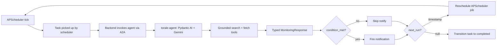

# Self-Scheduling Agents

A Torale monitoring task runs as a self-scheduling agent: each execution decides whether the condition is met _and_ when to run next. This page documents the runtime.

The public-facing explainer lives at [torale.ai/concepts/self-scheduling-agents](https://torale.ai/concepts/self-scheduling-agents). This doc is the engineering view.

## The loop



## Components

| Component | Lives in | Role |
| --- | --- | --- |
| Scheduler | `backend/src/torale/scheduler/` | APScheduler instance. Fires cron ticks, picks up tasks, reschedules based on agent output. |
| Agent service | `torale-agent/agent.py`, `torale-agent/server.py` | Pydantic AI agent behind an A2A-protocol server. Stateless per-execution. |
| Tools | `torale-agent/tools.py` | Parallel search, page fetch, activity logging. The agent decides which to call. |
| Task state | `backend/src/torale/tasks/tasks.py`, `.../service.py` | Three-state enum (active/paused/completed) guarded by a state machine. |

## Execution contract

The backend invokes the agent with a `MonitoringDeps` payload containing the task's `search_query`, `condition_description`, `notify_behavior`, `last_executed_at`, and optional `previous_answer`. The agent returns a typed `MonitoringResponse`:

```python
class MonitoringResponse(BaseModel):
    condition_met: bool
    answer: str                   # short, user-readable
    reasoning: str                # why the agent decided as it did
    sources: list[Source]         # filtered citations
    next_run: datetime | None     # None = task complete
    activity: list[ActivityStep]  # replayable trace for the UI
```

This schema is duplicated between `torale-agent/models.py` and `backend/src/torale/scheduler/models.py` (see the note in `CLAUDE.md`). Both must stay in sync.

## Scheduling semantics

Two behaviours matter:

**`notify_behavior="once"`** — fire at most one notification, then stop scheduling. When the agent returns `condition_met=true` with `next_run=null`, the backend fires the notification and transitions the task to `completed` via the state machine.

**`notify_behavior="always"`** — fire every time the condition is met. The agent returns a `next_run` even after matches, and the task remains `active`. The backend uses `previous_answer` to suppress trivially-identical notifications.

In both modes, the agent is the source of truth for cadence. The backend doesn't hard-code "check every N minutes"; it only ever respects `next_run`.

## Why this shape

- **Fewer false positives.** Grounded reasoning beats byte-diffs on dynamic pages.
- **Fewer wasted checks.** An agent that just found "announcement expected next week" can schedule itself tighter; one that found nothing can back off.
- **Clean termination.** A `notify_behavior="once"` task stops scheduling itself the moment the condition holds. No zombie cron jobs, no per-task TTL configuration.
- **Replayable runs.** The `activity` array in each response is a trace of what the agent did — surfaced in the frontend task detail view for debugging.

## Adding a new tool

Tools live in `torale-agent/tools.py` and are registered on the agent via `register_tools()`. Each tool is a Pydantic AI `@agent.tool` function with a typed signature and a docstring the LLM reads to decide when to call it.

Keep tools narrow: one job, typed inputs, typed outputs, and clear failure modes. The agent copes much better with "fetch page X" + "search for Y" composed together than with a single "do the right thing" mega-tool.

## Related

- [Grounded Search](/architecture/grounded-search) — what the agent does inside one execution
- [Task State Machine](/architecture/task-state-machine) — how tasks transition between active/paused/completed
