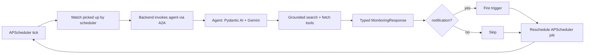

# Self-Scheduling Agents

A webwhen watch runs as a self-scheduling agent: each execution decides whether the condition is met _and_ when to run next. This page documents the runtime.

The public-facing explainer lives at [webwhen.ai/concepts/self-scheduling-agents](https://webwhen.ai/concepts/self-scheduling-agents). This doc is the engineering view.

::: tip Naming during the transition
The codebase still uses `torale-agent` as the service name and the database table is still called `tasks`. The product is now webwhen; the rename of internal modules and endpoints is a later phase.
:::

## The loop


```mermaid
flowchart LR
    A[APScheduler tick] --> B[Watch picked up by scheduler]
    B --> C[Backend invokes agent via A2A]
    C --> D[Agent: Pydantic AI + Gemini]
    D --> E[Grounded search + fetch tools]
    E --> F[Typed MonitoringResponse]
    F --> G{notification?}
    G -->|yes| H[Fire trigger]
    G -->|no| I[Skip]
    H --> J[Reschedule APScheduler job]
    I --> J
    J --> A
```

## Components

| Component | Lives in | Role |
| --- | --- | --- |
| Scheduler | `backend/src/webwhen/scheduler/` | APScheduler instance. Picks up watches and reschedules from agent output. |
| Agent service | `torale-agent/agent.py`, `torale-agent/server.py` | Pydantic AI agent behind an A2A-protocol server. Stateless per-execution. |
| Tools | `torale-agent/tools.py` | Perplexity, Parallel, Twitter, page fetch, memory, and connected read tools. The agent decides which to call. |
| Watch state | `backend/src/webwhen/tasks/tasks.py`, `.../service.py` | Three-state enum (active/paused/completed) controlled by users and administrators. |

## Execution contract

The backend sends the watch prompt and execution history over A2A. `MonitoringDeps` carries the user ID, watch ID, and scoped service clients. The agent returns a typed `MonitoringResponse`:

```python
class MonitoringResponse(BaseModel):
    evidence: str
    sources: list[str]
    confidence: int
    next_run: str | None
    notification: str | None
    topic: str | None
    activity: list[ActivityStep] | None
```

This schema is duplicated between `torale-agent/models.py` and `backend/src/torale/scheduler/models.py` (see the note in `CLAUDE.md`). Both must stay in sync.

## Scheduling semantics

The agent is the source of truth for cadence, but not lifecycle. It should always return a future `next_run`, including after a trigger. Execution history helps it avoid sending the same notification repeatedly.

Only an explicit user or administrator action may pause or complete a watch. If an agent returns `next_run=null`, the backend records that request, suppresses completion, and schedules a fallback run. Scheduling also re-checks watch state so an in-flight execution cannot resurrect a concurrently paused watch.

## Why this shape

- **Fewer false positives.** Grounded reasoning beats byte-diffs on dynamic pages.
- **Fewer wasted checks.** An agent that just found "announcement expected next week" can schedule itself tighter; one that found nothing can back off.
- **Safe continuity.** A single imperfect run cannot silently complete an ongoing watch.
- **Replayable runs.** The `activity` array in each response is a trace of what the agent did — surfaced in the frontend watch detail view for debugging.

## Adding a new tool

Tools live in `torale-agent/tools.py` and are registered on the agent via `register_tools()`. Each tool is a Pydantic AI `@agent.tool` function with a typed signature and a docstring the LLM reads to decide when to call it.

Keep tools narrow: one job, typed inputs, typed outputs, and clear failure modes. The agent copes much better with "fetch page X" + "search for Y" composed together than with a single "do the right thing" mega-tool.

## Related

- [Grounded Search](/architecture/grounded-search) — what the agent does inside one execution
- [Watch State Machine](/architecture/task-state-machine) — how watches transition between active/paused/completed
