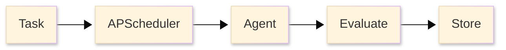

## Overview

Torale executes scheduled web searches, evaluates results against trigger conditions, and stores execution history. Grounded search combines Google Search with LLM evaluation for source-backed monitoring.

## Example

```python
from torale import ToraleClient

client = ToraleClient()

# Create a monitoring task
task = client.tasks.create(
    search_query="When is the iPhone 17 being released?",
    condition_description="Apple has announced a specific release date",
    schedule="0 9 * * *"  # Daily at 9 AM
)

# Check results
executions = client.tasks.get_executions(task.id)
if executions[0].condition_met:
    print(executions[0].result["answer"])
```

## Architecture



**Core Components:**
- **Monitoring Agent**: Gemini-powered agent (Pydantic AI) with Perplexity search and Mem0 memory
- **APScheduler**: Cron-based scheduling with agent-driven dynamic rescheduling
- **Condition Evaluation**: Agent determines if trigger condition is met, returns evidence + sources
- **Notifications**: Email and webhook delivery when conditions are met

## Interfaces

- [Web Dashboard](/getting-started/web-dashboard) - Browser-based task management
- [CLI](/getting-started/cli) - Command-line interface
- [Python SDK](/getting-started/sdk) - Programmatic access
- [API](/api/overview) - REST API reference
- [Self-Hosted](/getting-started/self-hosted) - Deploy on your infrastructure
