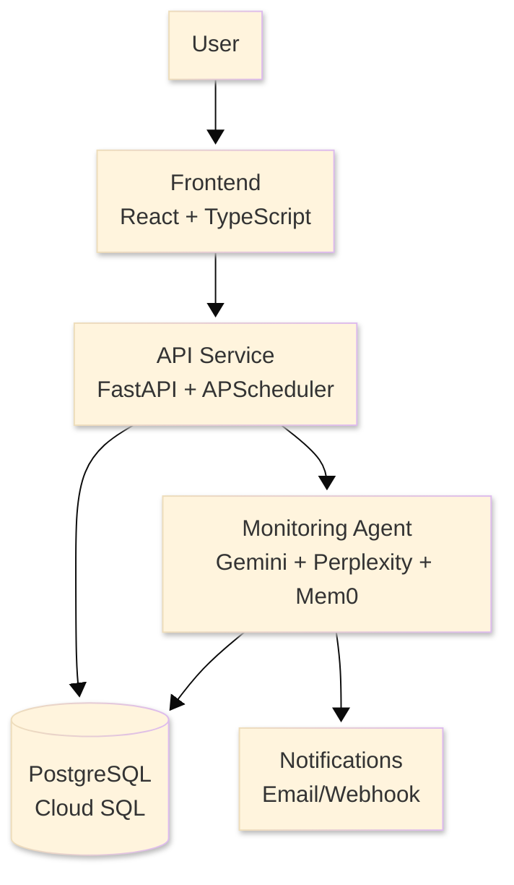

# Architecture

System architecture for self-hosted Torale deployments.

## Component Overview

## API Service

FastAPI application serving REST endpoints. Handles authentication via Clerk JWT tokens or API keys, validates requests, and coordinates with PostgreSQL for data persistence. APScheduler runs in-process for task scheduling.

Connects to PostgreSQL via Cloud SQL Proxy sidecar in Kubernetes, or direct connection in Docker Compose.

## Monitoring Agent

Gemini-powered agent (Pydantic AI) that searches the web via Perplexity, uses Mem0 for cross-run memory, evaluates conditions, and returns structured results (evidence, sources, confidence, notifications).

## Database Schema

PostgreSQL stores users (Clerk-integrated), API keys (hashed), tasks with configuration, execution history, and notifications. The schema uses JSONB columns for flexible configuration storage and state tracking.

Migrations managed through Alembic with forward-only migrations in production.

## Scaling Strategy

**API** - Horizontal Pod Autoscaler (HPA) scales based on CPU usage from 2 to 10 replicas

**Database** - Cloud SQL auto-scales storage and compute, with optional read replicas for high read loads

**Cost Optimization** - All pods use Spot VMs for 60-91% savings, with automatic migration on preemption

## Next Steps

- Set up [Docker Compose](/self-hosted/docker-compose)
- Deploy to [Kubernetes](/self-hosted/kubernetes)
- Read [Configuration](/self-hosted/configuration)
