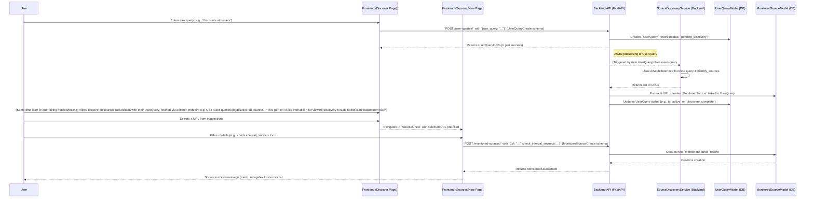
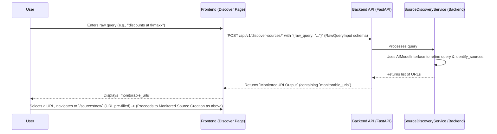

# Key User and Data Flows

This document outlines some of the key user interaction and data flows across the AmbiAlert frontend and backend systems. These flows are based on the Iteration 1 completed features.

## 1. User Authentication Flow

**Goal:** User signs up or signs in to access the application.

%%{init: {'theme': 'dark'}}%%
```mermaid
sequenceDiagram
    participant User
    participant Frontend (Next.js)
    participant Supabase Auth
    participant Backend API (FastAPI)

    User->>Frontend (Next.js): Navigates to Sign In/Sign Up page
    Frontend (Next.js)->>User: Displays Sign In/Sign Up form
    User->>Frontend (Next.js): Submits credentials (email, password)
    Frontend (Next.js)->>Supabase Auth: Attempts sign-up/sign-in (e.g., `supabase.auth.signInWithPassword()`)
    Supabase Auth-->>Frontend (Next.js): Returns session (JWT) or error
    Frontend (Next.js)->>Frontend (Next.js): Stores session (cookies via `@supabase/ssr`)
    Frontend (Next.js)-->>User: Redirects to dashboard/protected page or shows error

    Note over User, Backend API (FastAPI): Subsequent API Calls to Protected Resources
    User->>Frontend (Next.js): Accesses protected route (e.g., /dashboard)
    Frontend (Next.js)->>Frontend (Next.js): Middleware checks auth status (via Supabase session in cookies)
    alt Authenticated
        Frontend (Next.js)->>User: Renders protected page
        User->>Frontend (Next.js): Triggers action requiring API call (e.g., fetch sources)
        Frontend (Next.js)->>Frontend (Next.js): Axios interceptor attaches JWT from Supabase session to Authorization header
        Frontend (Next.js)->>Backend API (FastAPI): Makes API request with JWT
        Note right of Backend API (FastAPI): JWT verification by Backend API is assumed for protected resources; specific endpoint protection reviewed separately.
        Backend API (FastAPI)-->>Frontend (Next.js): Returns API response
    else Unauthenticated
        Frontend (Next.js)-->>User: Redirects to Sign In page
    end
```

**Details:**
1.  User interacts with auth forms on the frontend.
2.  Frontend uses Supabase client libraries (`@supabase/ssr`) to communicate with Supabase Auth for authentication.
3.  Successful authentication results in a session (including a JWT) being stored securely, typically in cookies managed by `@supabase/ssr`.
4.  Frontend middleware protects routes by checking for a valid Supabase session.
5.  For API calls to the backend, an Axios interceptor on the frontend retrieves the JWT and includes it in the `Authorization` header.
6.  The backend API (FastAPI) is expected to validate these JWTs for protected resources. However, explicit JWT verification was not found in the specific endpoint files reviewed (`monitoring.py`, `source_discovery.py`) during the last check. This might be handled globally, planned for implementation, or those specific routes might currently be open.

## 2. Source Discovery and Monitoring Setup Flow

**Goal:** User submits a query, discovers potential sources, and sets up a new monitored source.

%%{init: {'theme': 'dark'}}%%


**Details:**
1.  User inputs a raw query on the `/discover` page (frontend).
2.  Frontend sends this to `POST /user-queries/` on the backend.
3.  Backend creates a `UserQuery` record.
4.  **Asynchronously (or as part of the same request flow if simple):** The backend triggers the `SourceDiscoveryService`.
    *   This service uses an AI model to refine the query and find relevant URLs.
    *   For each discovered URL, a `MonitoredSource` record is created and linked to the initial `UserQuery`.
5.  The user, potentially on a different view or after a refresh/notification, sees the URLs that the system has identified as monitorable based on their query.
    *   *(The exact mechanism for frontend to get these URLs from `SourceDiscoveryService` after submitting a `UserQuery` needs to be clear - it might be polling the `UserQuery` status and then fetching related `MonitoredSource` records, or the `/discover-sources/` endpoint might be used directly by the frontend in a simplified flow if the `UserQuery` abstraction is more for backend processing).* For Iteration 1, the `progress.md` mentions frontend using `POST /api/v1/discover-sources/` which returns `monitorable_urls` directly. The `UserQuery` flow seems to be a more robust backend process that eventually creates `MonitoredSource` records.
6.  User selects a URL and is taken to the `/sources/new` page (frontend) with the URL pre-filled.
7.  User submits the form, and the frontend calls `POST /monitored-sources/` to create the specific `MonitoredSource` in the backend.

**Clarified Flow based on `progress.md` for Iteration 1 Frontend Source Discovery:**

%%{init: {'theme': 'dark'}}%%


## 3. Content Ingestion, Change Detection, and Alerting Flow (Conceptual Backend - Iteration 2 Focus for Automation)

**Goal:** System automatically monitors sources, detects changes, and creates alerts.

%%{init: {'theme': 'dark'}}%%
```mermaid
sequenceDiagram
    participant Scheduler (e.g., Celery - Iteration 2)
    participant ContentIngestionService (Backend)
    participant ChangeDetectionService (Backend)
    participant AIModelInterface (Backend)
    participant Database (Models: MonitoredSource, ScrapedContent, ContentEmbedding, ChangeAlert)
    participant User
    participant Frontend (Alerts Page)

    Scheduler->>ContentIngestionService (Backend): Triggers periodic check for a `MonitoredSource`
    ContentIngestionService (Backend)->>Database (Models: MonitoredSource, ScrapedContent, ContentEmbedding, ChangeAlert): Fetches `MonitoredSource` details (URL)
    ContentIngestionService (Backend)->>External Website: Scrapes content from URL
    ContentIngestionService (Backend)->>ContentIngestionService (Backend): Preprocesses content
    ContentIngestionService (Backend)->>AIModelInterface (Backend): `generate_embeddings(processed_content)`
    AIModelInterface (Backend)-->>ContentIngestionService (Backend): Returns embeddings
    ContentIngestionService (Backend)->>Database (Models: MonitoredSource, ScrapedContent, ContentEmbedding, ChangeAlert): Stores `ScrapedContent` and `ContentEmbedding` records

    Scheduler->>ChangeDetectionService (Backend): Triggers change detection for the `MonitoredSource`
    ChangeDetectionService (Backend)->>Database (Models: MonitoredSource, ScrapedContent, ContentEmbedding, ChangeAlert): Fetches current and previous `ContentEmbedding` for the URL
    ChangeDetectionService (Backend)->>ChangeDetectionService (Backend): Compares embeddings (e.g., cosine similarity)
    alt Significant Change Detected
        ChangeDetectionService (Backend)->>AIModelInterface (Backend): (Optional) `analyze_diff(old_content, new_content)` for summary
        AIModelInterface (Backend)-->>ChangeDetectionService (Backend): Returns change summary
        ChangeDetectionService (Backend)->>Database (Models: MonitoredSource, ScrapedContent, ContentEmbedding, ChangeAlert): Creates `ChangeAlert` record (summary, details, link to source)
    end

    User->>Frontend (Alerts Page): Navigates to `/alerts`
    Frontend (Alerts Page)->>Backend API (FastAPI): `GET /alerts/`
    Backend API (FastAPI)->>Database (Models: MonitoredSource, ScrapedContent, ContentEmbedding, ChangeAlert): Fetches `ChangeAlert` records for the user
    Database (Models: MonitoredSource, ScrapedContent, ContentEmbedding, ChangeAlert)-->>Backend API (FastAPI): Returns alerts
    Backend API (FastAPI)-->>Frontend (Alerts Page): Returns list of `ChangeAlertSchema`
    Frontend (Alerts Page)-->>User: Displays alerts

    User->>Frontend (Alerts Page): Clicks "Acknowledge" on an alert
    Frontend (Alerts Page)->>Backend API (FastAPI): `POST /alerts/{alert_id}/acknowledge`
    Backend API (FastAPI)->>Database (Models: MonitoredSource, ScrapedContent, ContentEmbedding, ChangeAlert): Updates `ChangeAlert.is_acknowledged` to true
    Database (Models: MonitoredSource, ScrapedContent, ContentEmbedding, ChangeAlert)-->>Backend API (FastAPI): Confirms update
    Backend API (FastAPI)-->>Frontend (Alerts Page): Returns updated `ChangeAlertSchema`
    Frontend (Alerts Page)-->>User: Updates UI (marks alert as acknowledged)
```

**Details:**
1.  **Automated Background Tasks (Iteration 2):** A scheduler (like Celery) will periodically trigger services.
2.  **Content Ingestion:**
    *   `ContentIngestionService` fetches a `MonitoredSource` URL.
    *   Scrapes content from the live website.
    *   Preprocesses the text.
    *   Uses an AI model (via `AIModelInterface`) to generate vector embeddings.
    *   Saves the scraped content and its embeddings to the database.
3.  **Change Detection:**
    *   `ChangeDetectionService` retrieves the newly generated embeddings and the previous embeddings for the same URL.
    *   Compares these embeddings to determine if a significant change has occurred (e.g., based on a similarity threshold).
    *   If a significant change is found, it may optionally use an AI model to summarize the change.
    *   A `ChangeAlert` record is created in the database.
4.  **Alert Viewing and Acknowledgment (Frontend):**
    *   User navigates to the `/alerts` page.
    *   Frontend calls `GET /alerts/` to fetch alerts from the backend.
    *   User can view alert details and acknowledge them.
    *   Acknowledging an alert calls `POST /alerts/{alert_id}/acknowledge` on the backend, which updates the alert's status.

These flows provide a high-level understanding of how users interact with AmbiAlert and how data moves through the system to achieve its monitoring and alerting goals. 