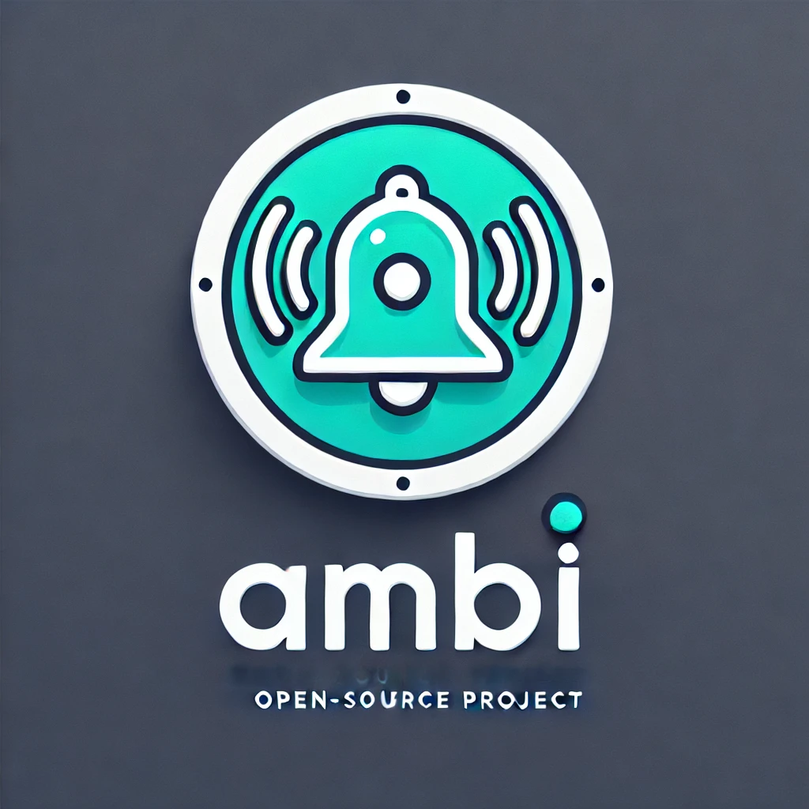

# AmbiAlert Documentation

<div align="center">
    
</div>

AmbiAlert is a powerful web monitoring tool that helps you stay informed about topics that matter to you. Instead of constantly checking websites for updates, AmbiAlert does the work for you by monitoring relevant web pages and alerting you when meaningful changes occur.

## Features

- 🔍 **Smart Query Expansion**: Automatically expands your search queries to cover different aspects of your topic
- 🌐 **Intelligent Web Monitoring**: Tracks relevant websites and detects meaningful changes
- 🤖 **AI-Powered Relevance Checking**: Uses advanced language models to ensure changes are actually relevant to your interests
- 📧 **Flexible Alerting System**: Supports email notifications with more backends coming soon
- 💾 **Persistent Monitoring**: Uses SQLite to track monitored URLs and their states
- 🔄 **Automatic Retries**: Handles temporary failures gracefully

## Quick Start

### Installation

```bash
pip install ambi-alert
```

### Basic Usage

The simplest way to use AmbiAlert is through its command-line interface:

```bash
# Monitor news about the next iPhone (prints alerts to console)
ambi-alert "next iPhone release"
```

### Email Notifications

To receive email notifications:

```bash
ambi-alert "next iPhone release" \
    --smtp-server smtp.gmail.com \
    --smtp-port 587 \
    --smtp-username your.email@gmail.com \
    --smtp-password "your-app-password" \
    --from-email your.email@gmail.com \
    --to-email target.email@example.com
```

### Check Frequency

Control how often AmbiAlert checks for updates:

```bash
# Check every 15 minutes
ambi-alert "next iPhone release" --check-interval 900
```

## Python API

You can also use AmbiAlert programmatically:

```python
from ambi_alert import AmbiAlert
from ambi_alert.alerting import EmailAlertBackend

# Create an alert backend (optional)
alert_backend = EmailAlertBackend(
    smtp_server="smtp.gmail.com",
    smtp_port=587,
    username="your.email@gmail.com",
    password="your-app-password",
    from_email="your.email@gmail.com",
    to_email="target.email@example.com"
)

# Create AmbiAlert instance
async with AmbiAlert(alert_backend=alert_backend) as ambi:
    # Add queries to monitor
    await ambi.add_monitoring_query("next iPhone release")
    await ambi.add_monitoring_query("AI breakthrough")

    # Start monitoring
    await ambi.run_monitor()
```

## How It Works

1. **Query Expansion**: When you add a query, AmbiAlert:

   - Expands your query to cover different aspects of the topic
   - Searches the web using DuckDuckGo to find relevant pages
   - Stores the URLs and their current content state in a database

2. **Monitoring**: While running, AmbiAlert:
   - Periodically checks each monitored URL for changes
   - Uses AI to determine if changes are relevant to your query
   - Generates a human-readable summary of relevant changes
   - Sends alerts through configured backends

## Next Steps

- Check out the [Modules](modules.md) documentation for detailed API reference
- Learn about [Configuration](configuration.md) options
- See [Advanced Usage](advanced.md) for more features
- Read the [Contributing Guide](contributing.md) to help improve AmbiAlert
